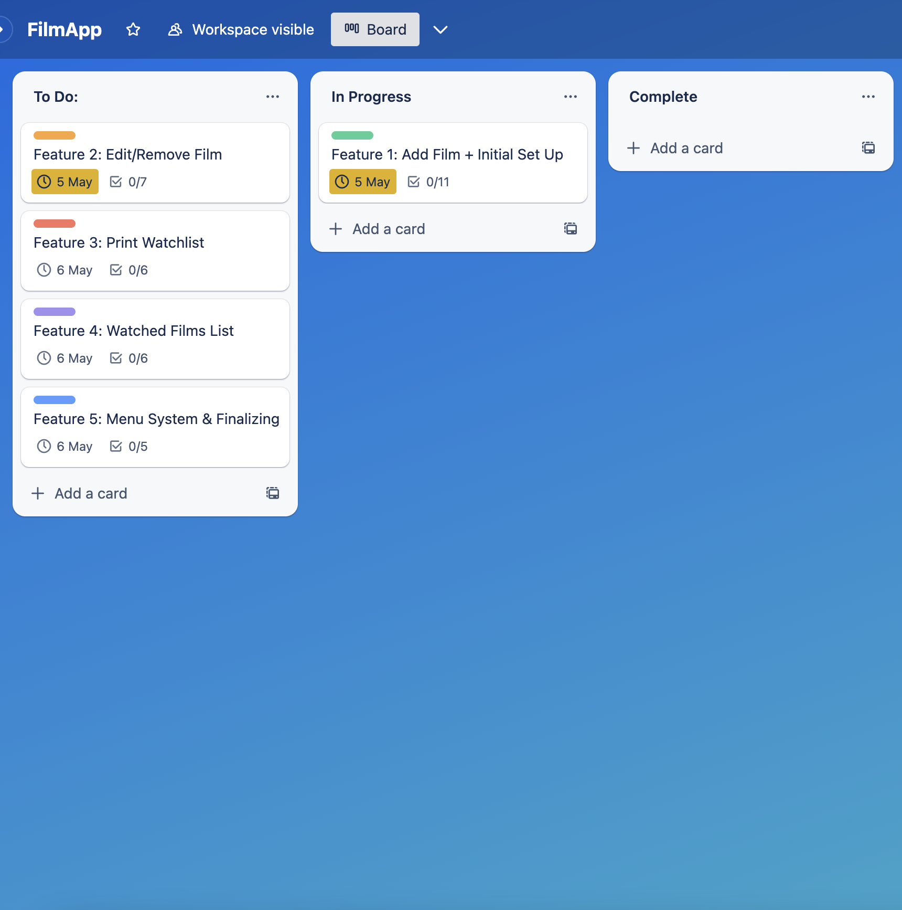
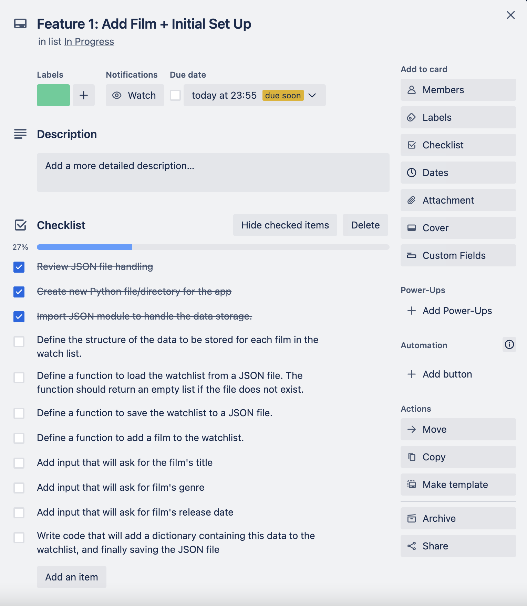
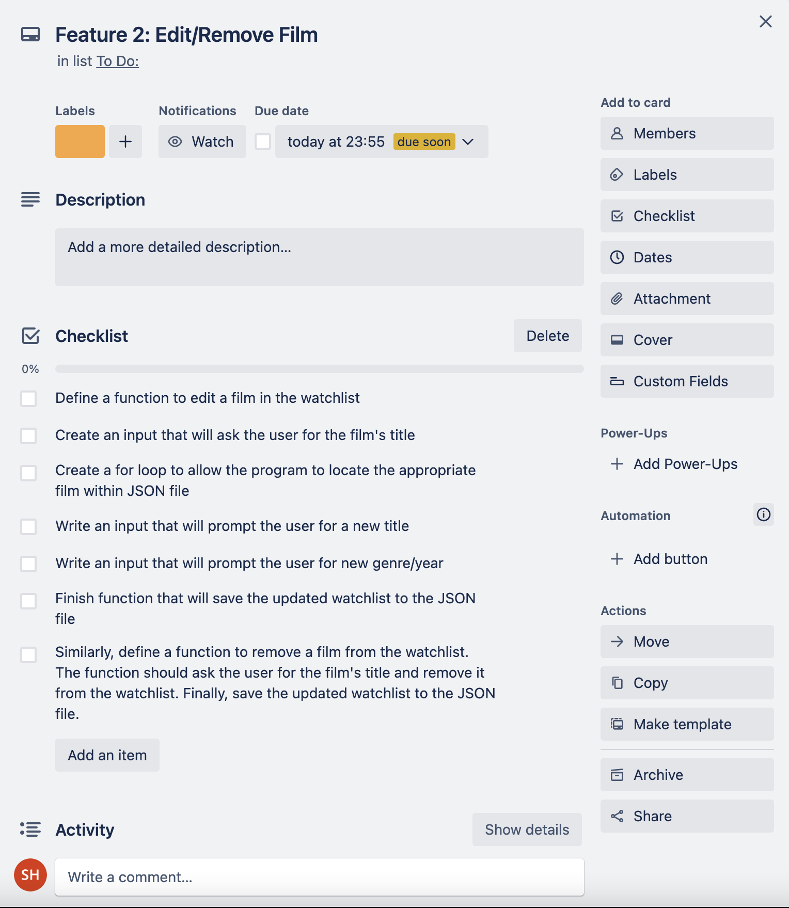
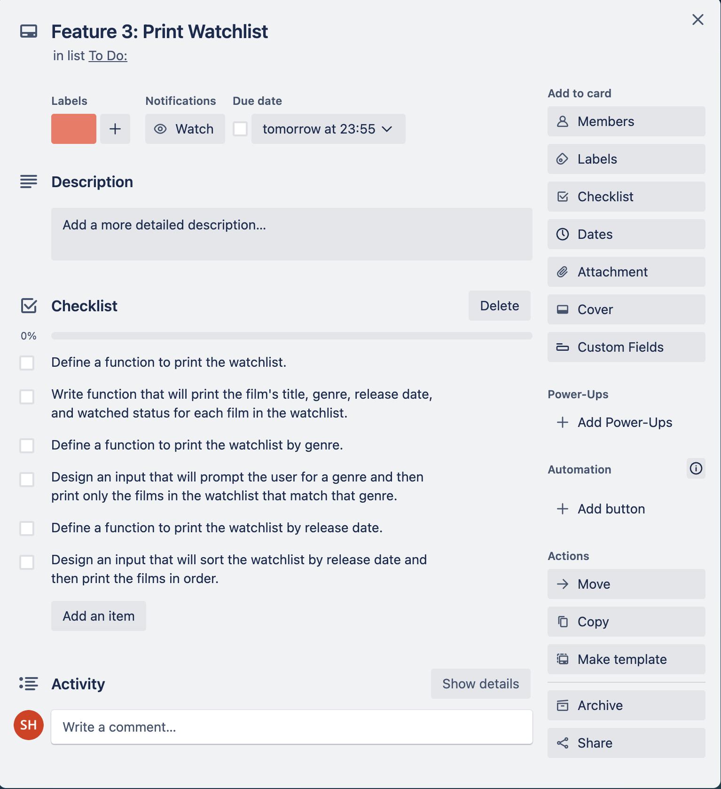
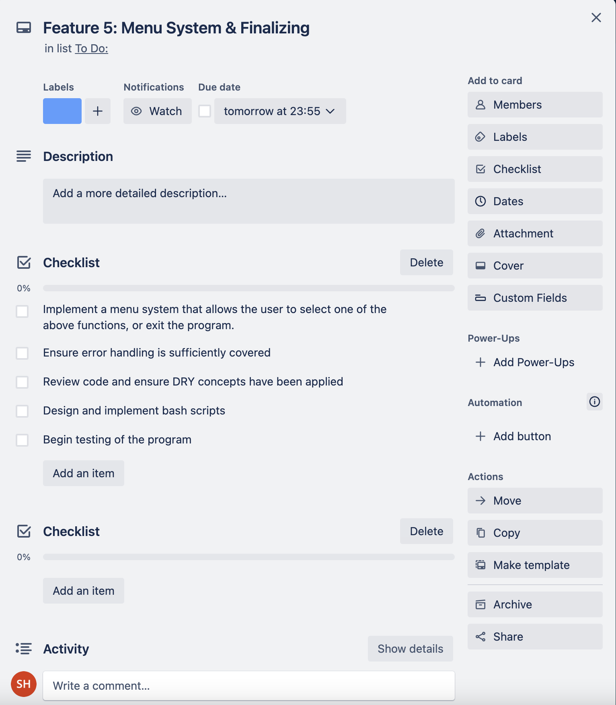

# **FilmApp**
## [GitHub Repo](https://github.com/shalforb/T1A3---Terminal-Application)
## [Source Control](https://github.com/shalforb/T1A3---Terminal-Application/commits/master)
## [Trello Board](https://trello.com/invite/b/TCKk92x8/ATTI3e965815939b6d437ced36e0051ec8e80CCD745E/filmapp)

 

## **App Description & Purpose**
This is a simple terminal app that was contructed using Python. By using the json file handling module, the app will allow users to add and keep track of films that they intend to watch. Users will have access to a variety of main functions including:
<ol>
<li>Searching for films utilising the cinemagoer package, and optionally adding them to the watchlist
<li>Adding films to their watchlist manually
<li>Editing films in their watchlist
<li>Removing films in their watchlist
<li>Printing and accessing their watchlist
<li>Printing their watchlist by genre
<li>Printing their watchlist by release date
<li>Marking their films as watched
<li>Printing their list of watched films
</ol>

 

## **Style Guide**
To construct the app, PEP 8 style conventions was primarily utilised. Here are some of the specific style choices that were made:
* Indentation: Four spaces for indentation, which is the standard recommended by PEP 8.
* Naming conventions: PEP 8 naming conventions for variables, functions, and arguments. Specifically, snake_case for variables and functions, and used descriptive names that are easy to read and understand.
* Line length: Line length under 79 characters WAS USED as recommended by PEP 8, except for the docstrings which can be longer.
* Comments: Comments were included to explain the purpose and functionality of each function.
* Blank lines: Blank lines between function definitions and between logical blocks of code were used to improve readability.

 

## **Features**

 

### Feature 1 - Searching for films
To allow users to track and add films in the simplest way possible, the search_film function creates a method to add films that utilizes IMDb data with the integration of the [cinemagoer](https://cinemagoer.github.io/) package. With this package installed, the program can make use of the *search_movie* function when the user inputs a title. This will then execute a search through IMDb's data for movies with a given (or similar) title, and retrieve and print out the data with the most similar title that matches the user input. To keep the program relatively trim, this function only retrieves the movie's Title, Genre, and Release Date. After the data is retrieved, the program will prompt the user to give them the option of adding it to their watchlist, which if executed the program will append the film and its data into a seperate watchlist JSON file as a dictionary with appropriate key-value pairs.

 

### Feature 2 - Adding a film manually
Given the search function may run into issues finding specific movies the user may also opt to add a film manually if the search function does not return the data. This prompts the user to add the film's Title, Genre, and Release Date manually, which will then also append the data into the JSON document.

 

### Feature 3 & 4 - Editing and removing films
The program also allows the user to edit or remove films they have previously added to the watchlist. When editing a film, the same three prompts from add_film will be executed to allow the user to update any of these values. The option to remove a fil from the watchlist is also available.

 

### Feature 5, 6 & 7 - Printing the watchlist
While printing the watchlist, it was important to maintain a high level of readability. For this reason, the Python package [PrettyTable](https://pypi.org/project/prettytable/) was utilized in order to display the data clearly. By using this package, the keys and respected values are neatly arranged into columns and rows within an ASCII table. The user also has the options to order the data by their specific values, such as the genre or release date of the films.

 

### Feature 8 - Marking a film as watched & printing the watchlist
When a user wants to mark a film they have seen in their watchlist, they can do so using this feature. This function will then remove the specific film from the watchlist, and then append it to a seperate file named *watched*. Much like the watchlist file, this can be printed and displayed in a readable ASCII table.

 

## **Implementation Plan**

In order to facilitate the planning and execution of this application, I opted to employ a Trello Board as a tool for monitoring the specific tasks necessary for the development of each feature. These tasks have been arranged in a checklist format within a card designated for each of the four features. Within these cards, a due date has been assigned. 

As I began to work through the plan, I realised it was easier to run and test the code if I moved the main menu feature forward (initially planned as one of the last tasks) so I could test the program more thoroughly as I implemented more features.
 

/
## **Help Documentation**

