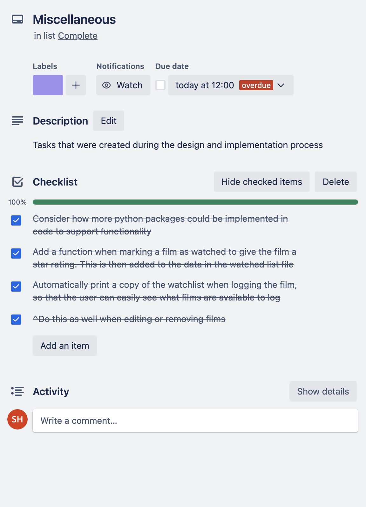

# **FilmTracker**
## [GitHub Repo](https://github.com/shalforb/T1A3---Terminal-Application)
## [Source Control](https://github.com/shalforb/T1A3---Terminal-Application/commits/master)
## [Trello Board](https://trello.com/invite/b/TCKk92x8/ATTI3e965815939b6d437ced36e0051ec8e80CCD745E/filmapp)
## [Presentation](https://youtu.be/d1wijl66hGY)

<br>

## **App Description & Purpose**
This is a simple terminal app that was contructed using Python. By using the JSON file handling module, the app will allow users to add and keep track of films that they intend to watch. Users will have access to a variety of main functions including:
<ol>
<li>Searching for films utilising the cinemagoer package, and optionally adding them to the watchlist
<li>Adding films to their watchlist manually
<li>Editing films in their watchlist
<li>Removing films in their watchlist
<li>Printing and accessing their watchlist
<li>Printing their watchlist by genre
<li>Printing their watchlist by release date
<li>Marking their films as watched
<li>Printing their list of watched films
</ol>

<br>

## **Style Guide**
To construct the app, PEP 8 style conventions was primarily utilised. Here are some of the specific style choices that were made:
* Indentation: Four spaces for indentation, which is the standard recommended by PEP 8.
* Naming conventions: PEP 8 naming conventions for variables, functions, and arguments. Specifically, snake_case for variables and functions, and used descriptive names that are easy to read and understand.
* Line length: Line length under 79 characters WAS USED as recommended by PEP 8, except for the docstrings which can be longer.
* Comments: Comments were included to explain the purpose and functionality of each function.
* Blank lines: Blank lines between function definitions and between logical blocks of code were used to improve readability.

<br>

## **Features**

<br>

### Feature 1 - Searching for films
To allow users to track and add films in the simplest way possible, the search_film function creates a method to add films that utilizes IMDb data with the integration of the [cinemagoer](https://cinemagoer.github.io/) package. With this package installed, the program can make use of the *search_movie* function when the user inputs a title. This will then execute a search through IMDb's data for movies with a given (or similar) title, and retrieve and print out the data with the most similar title that matches the user input. To keep the program relatively trim, this function only retrieves the movie's Title, Genre, and Release Date. After the data is retrieved, the program will prompt the user to give them the option of adding it to their watchlist, which if executed the program will append the film and its data into a seperate watchlist JSON file as a dictionary with appropriate key-value pairs.

<br>

### Feature 2 - Adding a film manually
Given the search function may run into issues finding specific movies the user may also opt to add a film manually if the search function does not return the data. This prompts the user to add the film's Title, Genre, and Release Date manually, which will then also append the data into the JSON document.

<br>

### Feature 3 & 4 - Editing and removing films
The program also allows the user to edit or remove films they have previously added to the watchlist. When editing a film, the same three prompts from add_film will be executed to allow the user to update any of these values. The option to remove a fil from the watchlist is also available.

<br>

### Feature 5, 6 & 7 - Printing the watchlist
While printing the watchlist, it was important to maintain a high level of readability. For this reason, the Python package [PrettyTable](https://pypi.org/project/prettytable/) was utilized in order to display the data clearly. By using this package, the keys and respected values are neatly arranged into columns and rows within an ASCII table. The user also has the options to order the data by their specific values, such as the genre or release date of the films.

<br>

### Feature 8 - Marking a film as watched & printing the watchlist
When a user wants to mark a film they have seen in their watchlist, they can do so using this feature. This function will then remove the specific film from the watchlist, and then append it to a seperate file named *watched*. While logging a watched film, the program will prompt the user to enter a date (DD-MM-YY) to mark the date in which the film was watched - the [datetime](https://docs.python.org/3/library/datetime.html) package is used to store this value as datetime data. It will also prompt the user to rate the film on a scale of 1-5 which will also be stored in the file. Much like the watchlist file, this can be printed and displayed in a readable ASCII table.

<br>

## **Implementation Plan**

In order to facilitate the planning and execution of this application, I opted to employ a Trello Board as a tool for monitoring the specific tasks necessary for the development of each feature. These tasks have been arranged in a checklist format within a card designated for each of the four features. Within these cards, a due date and appropriate labels have been assigned. 

### Intitial Trello Plan:

<br>


<br>
As I began to work through the plan, many of the tasks became prioritized differently; for example I realised it was easier to run and test the code if I moved the main menu feature forward (initially planned as one of the last tasks) so I could test the program more thoroughly as I implemented more features. New cards were created as I began to develop a better understanding of what the app could potentially be. A 'miscellaneous' card was created which allowed for random features that I knew had to be implemented that I did not consider before starting to develop the app. An 'optional' card was created so I could add inconsequential features that I could integrate if time allowed. If I ran into a major error that was proving extremely difficuly and time-consuming to debug, I added it to a seperate errors card. I also added seperate cards for when I discovered a package I wanted to integrate into the app.

<br>

### Final Trello Plan

<br>




<br>

## **Testing**

<br>

### Testing the Add/remove film functions

<br>

```

import pytest
import json
from filmtracker import load_watchlist, save_watchlist, add_film, remove_film

WATCHLIST_FILE = 'watchlist.json'

def test_add_film():
    # Create an empty watchlist file
    with open(WATCHLIST_FILE, 'w') as f:
        json.dump([], f)

    # Add a film to the watchlist
    add_film()
    watchlist = load_watchlist()
    assert len(watchlist) == 1
    assert watchlist[0]['title'] == 'Test Movie'
    assert watchlist[0]['genre'] == 'Action'
    assert watchlist[0]['release_date'] == 2023

    # Add another film to the watchlist
    add_film()
    watchlist = load_watchlist()
    assert len(watchlist) == 2

def test_remove_film():
    # Create a watchlist file with two films
    with open(WATCHLIST_FILE, 'w') as f:
        json.dump([
            {
                'title': 'Test Movie 1',
                'genre': 'Action',
                'release_date': 2023
            },
            {
                'title': 'Test Movie 2',
                'genre': 'Comedy',
                'release_date': 2022
            }
        ], f)

    # Remove a film from the watchlist
    remove_film()
    watchlist = load_watchlist()
    assert len(watchlist) == 1
    assert watchlist[0]['title'] == 'Test Movie 2'
    assert watchlist[0]['genre'] == 'Comedy'
    assert watchlist[0]['release_date'] == 2022

    # Try to remove a film that doesn't exist
    with pytest.raises(SystemExit):
        remove_film()
```

These two pytest tests are designed to test the add_film() and remove_film() functions.

The test_add_film() function first creates an empty watchlist file by opening watchlist.json in write mode and writing an empty list to it using the json.dump() function. The function then calls the add_film() function, which prompts the user for details about a film and adds it to the watchlist file. The function then loads the watchlist file using the load_watchlist() function and checks that the length of the list is 1, and that the details of the added film match the expected values. The function then repeats the process by calling add_film() again and checks that the length of the list is now 2. This test is checking that the add_film() function correctly adds films to the watchlist and that the watchlist file is updated with the correct data.

The test_remove_film() function first creates a watchlist file by opening watchlist.json in write mode and writing a list of two films to it using the json.dump() function. The function then calls the remove_film() function, which prompts the user to select a film to remove from the watchlist and removes it from the file. The function then loads the watchlist file using the load_watchlist() function and checks that the length of the list is 1, and that the details of the remaining film match the expected values. The function then tries to remove a film that doesn't exist in the watchlist and checks that a SystemExit exception is raised. This test is checking that the remove_film() function correctly removes films from the watchlist and that it handles errors correctly.

<br>

## **Help Documentation**

<br>

### Instructions to assist with downloading and running FilmTracker.

<br>

### **System Requirements:**

<br>

FilmTracker is a Python program that requires Python 3. You can check if you have Python installed by entering the following command in your terminal: python --version

If you do not have Python installed, you can visit [Python's official website](https://www.python.org/downloads/)

<br>

### **Downloading and Running FilmTracker:**

<br>

### **Option One:**

<br>

- Make sure you have Python 3 installed on your computer. You can check which version you have with the following command in your terminal.
```
python3 --version
```

- If you don't have Python 3 installed, you can get it from here: https://www.python.org/downloads/

- Open the terminal and go to the desired location on your computer. Create a directory and initialize a repository in that directory with the command:
```
git init
```

- From within your directory, clone the FilmTracker repository with the command:
```
git clone https://github.com/shalforb/T1A3---Terminal-Application
```

- Use the cd command to enter the directory titled **T1A3---Terminal-Application**

- Initialize FilmTracker by running the bash script called setup_filmtracker.sh with the command:
```
bash setup_filmtracker.sh
```

- Launch FilmTracker by running the bash script called run_filmtracker.sh with the command:
```
bash run_filmtracker.sh
```


<br>

### **Option Two:**

<br>


- Go to https://github.com/shalforb/T1A3---Terminal-Application and click the green button that says <> Code, then click Download ZIP.

- Open the downloaded ZIP file and extract the directory.

- Open your terminal and navigate to the extracted directory (titled T1A3---Terminal-Application-master).

- WInitialize FilmTracker by running the bash script called setup_filmtracker.sh with the command:
```
bash setup_filmtracker.sh
```

- Launch FilmTracker by running the bash script called run_filmtracker.sh with the command: 
```
bash run_filmtracker.sh
```

When you run the executables, FilmTracker will automatically:

- Check if you have Python 3 installed, and if not, provide you with instructions on how to install it.
- Create a virtual environment for you.
- Activate the virtual environment for you.
- Install all required dependencies you need to run the app. This is done from the requirements.txt file.
- Run the application for you.
- Finally, deactivate the virtual environment.

<br>

## **References**

1. IMDbPY. (n.d.). Latest documentation. Retrieved from https://readthedocs.org/projects/imdbpy/downloads/pdf/latest/

2. PrettyTable 2.2.0. (2021). Retrieved from https://pypi.org/project/prettytable/

3. ‌peps.python.org. PEP 8 – Style Guide for Python Code | peps.python.org. Retrieved from: https://peps.python.org/pep-0008/.


