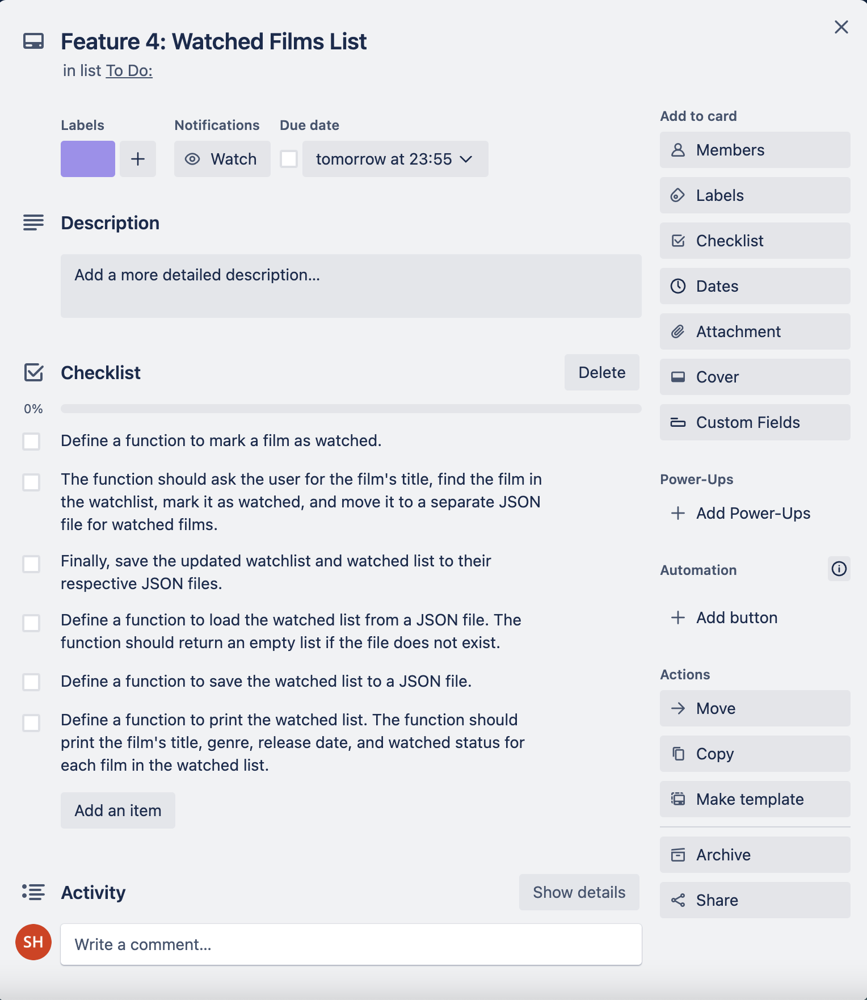

# **FilmWatch**
## [GitHub Repo](https://github.com/shalforb/T1A3---Terminal-Application)
## [Source Control](https://github.com/shalforb/T1A3---Terminal-Application/commits/master)
/
## **App Description & Purpose**
This is a simple terminal app that was contructed using Python. By using the json file handling module, the app will allow users to add and keep track of films that they intend to watch. Users will have access to a variety of main functions including:
<ol>
<li>Adding films to their watchlist, including data such as the genre of the film and year of release (more information can be implemented in future)
<li>Editing films in their watchlist
<li>Removing films in their watchlist
<li>Printing and accessing their watchlist
<li>Printing their watchlist by genre
<li>Printing their watchlist by release date
<li>Marking their films as watched
<li>Printing their list of watched films
</ol>

## **Style Guide**
To construct the app, PEP 8 style conventions was primarily utilised. Here are some of the specific style choices that were made:
* Indentation: Four spaces for indentation, which is the standard recommended by PEP 8.
* Naming conventions: PEP 8 naming conventions for variables, functions, and arguments. Specifically, snake_case for variables and functions, and used descriptive names that are easy to read and understand.
* Line length: Line length under 79 characters WAS USED as recommended by PEP 8, except for the docstrings which can be longer.
* Comments: Comments were included to explain the purpose and functionality of each function.
* Blank lines: Blank lines between function definitions and between logical blocks of code were used to improve readability.

## **Features**
/
## **Implementation Plan**

In order to facilitate the planning and execution of this application, I opted to employ a Trello Board as a tool for monitoring the specific tasks necessary for the development of each feature. These tasks have been arranged in a checklist format within a card designated for each of the four features. Within these cards, a due date has been assigned.
 

/
## **Help Documentation**

